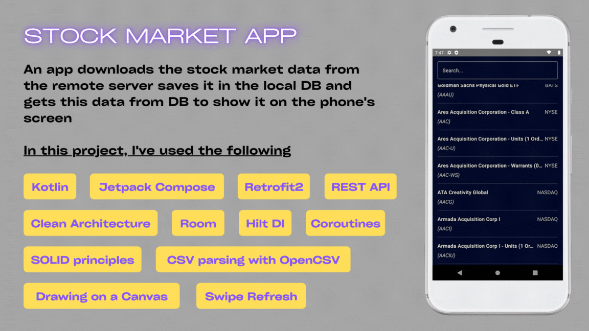

# Stock Market App

---

## **Project Overview**

**_Stock Market App_** - an app downloads the stock market data from the remote
server saves it in the local DB and gets this data from DB to show it on the phone's
screen

---

## **Used Libraries**

- [Kotlin](https://github.com/JetBrains/kotlin/releases/tag/v1.7.10)
- [Jetpack Compose](https://developer.android.com/jetpack/compose)
- [Retrofit 2](https://github.com/square/retrofit)
- [Room](https://developer.android.com/jetpack/androidx/releases/room)
- [Hilt DI](https://dagger.dev/hilt/)
- [Coroutines](https://kotlinlang.org/docs/coroutines-overview.html)
- [OpenCSV](https://www.baeldung.com/opencsv)
- [Swipe Refresh](https://google.github.io/accompanist/swiperefresh/)

---

## **What I've Learned?**

In this project I have gotten success in:

- working with Jetpack Compose
- leveraging third-party libraries in the app
- working with REST API
- using the Clean Architectural Guidelines and SOLID principles
- using dependency injection with Dagger-Hilt
- CSV parsing with OpenCSV
- working with remote APIs using Retrofit
- creating local cache with Room
- drawing on a canvas using Compose
- managing with Swipe Refresh for Jetpack Compose library

---